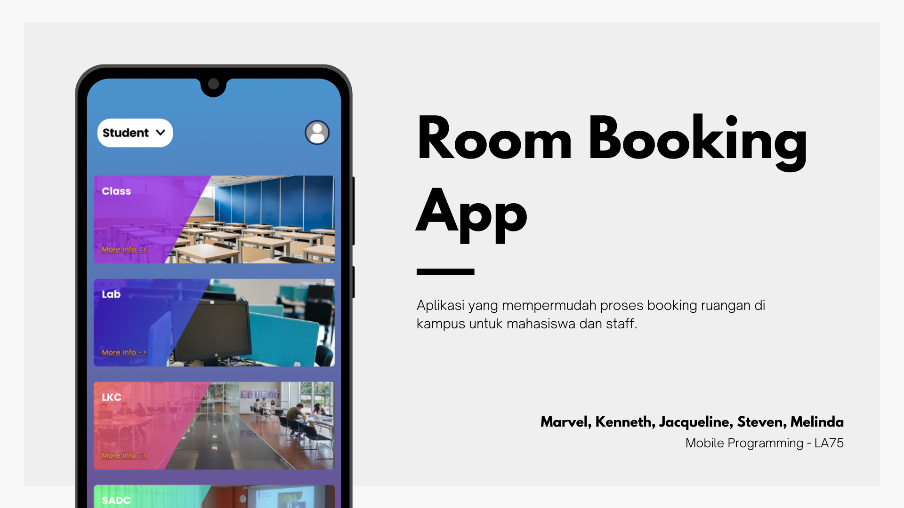
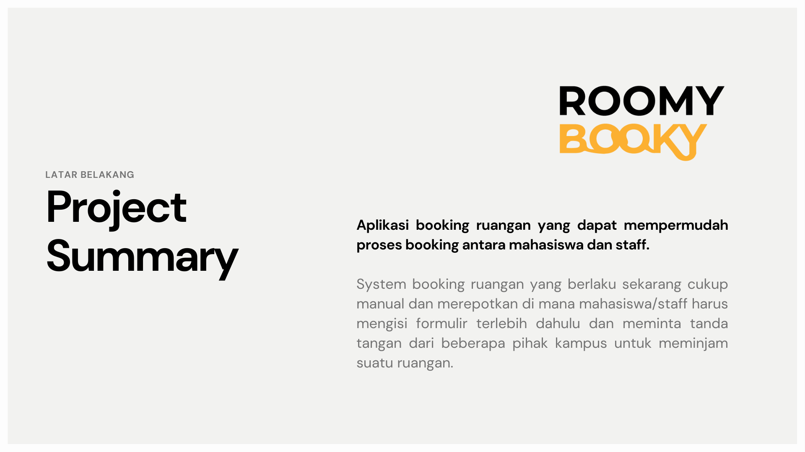
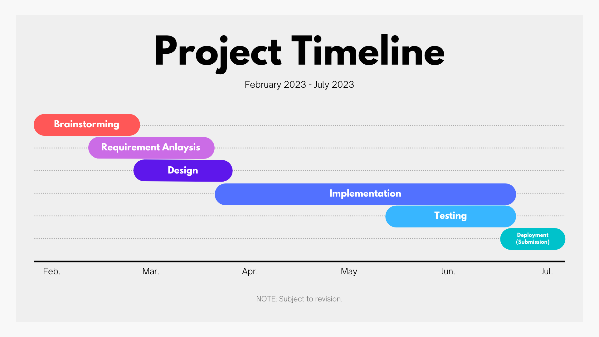
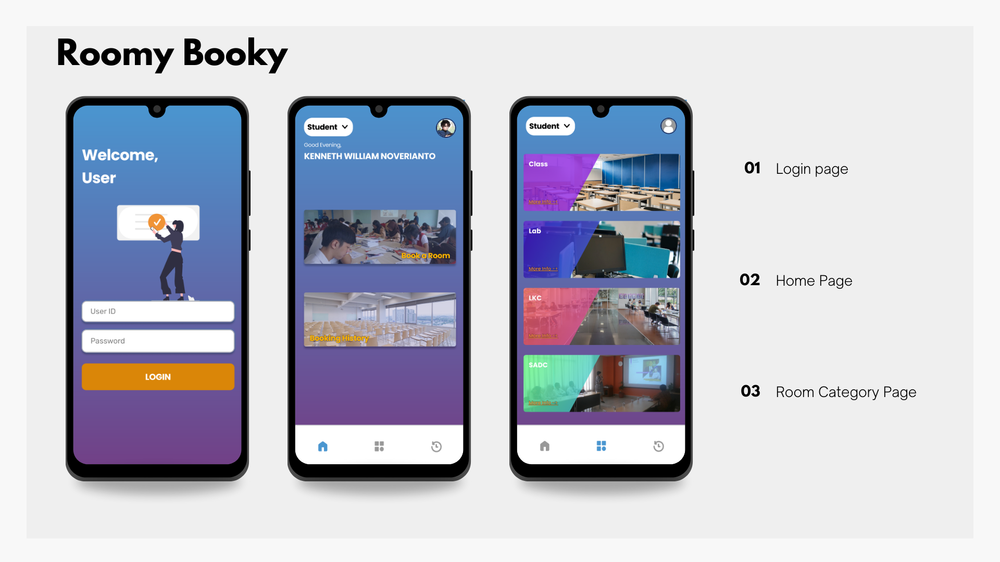
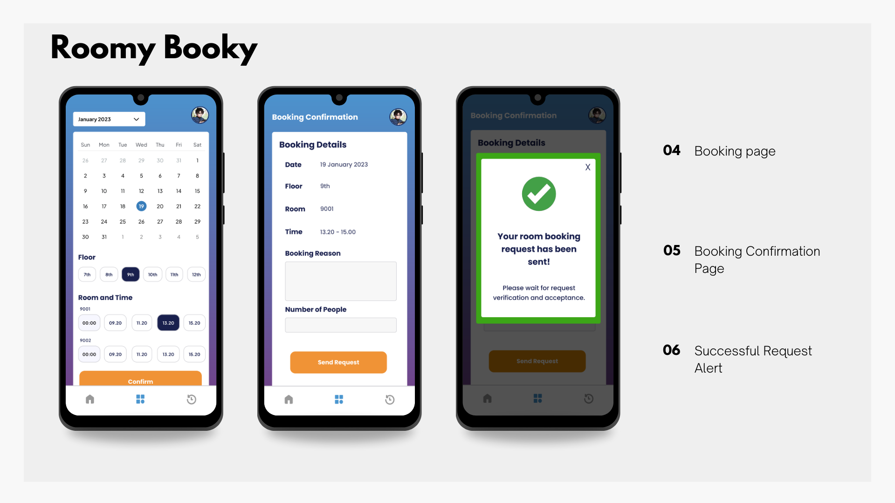
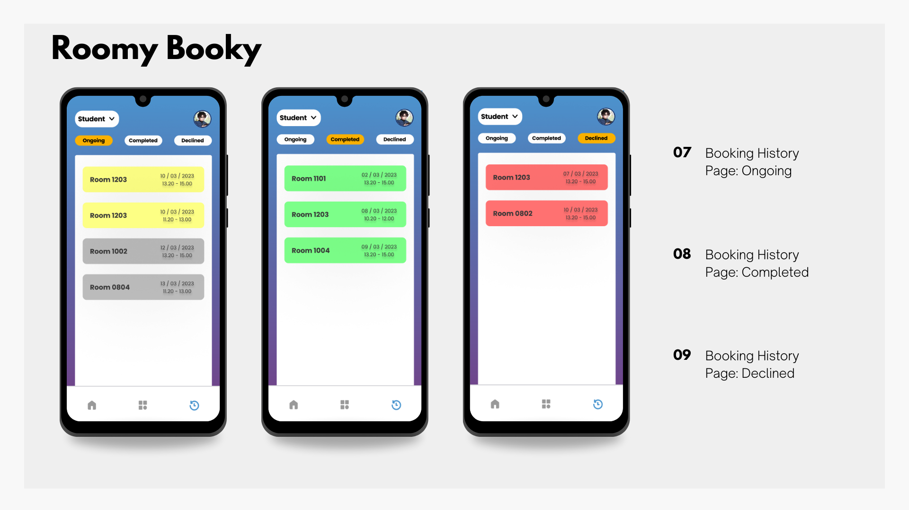
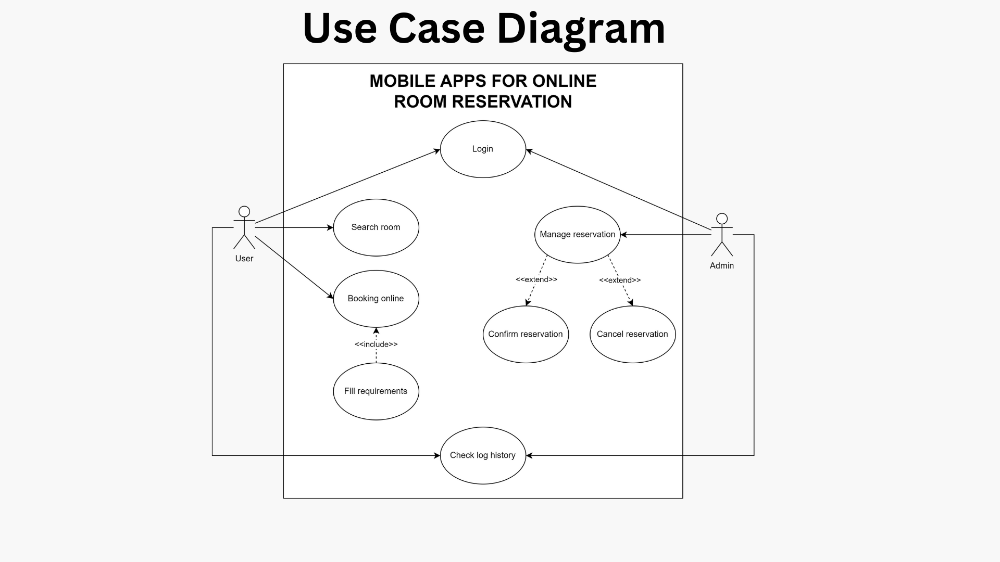

# RoomyBooky
RoomyBooky is a room booking application for students and staff when booking rooms on campus. This app was developed as our final project for the Mobile Programming course.

**Contributors** 
* [Marvelius Putra Kenardi](https://github.com/Marvelius-Putra) - 2501964485
* [Kenneth William Noverianto](https://github.com/kennethwn) - 2501973722
* [Jacqueline Abyasa](https://github.com/jacqabyasa) - 2540133234
* [Steven The](https://github.com/nepucchi) - 2540117584
* [Lie Melinda Putri Wardana](https://github.com/minisvgar) - 2501964730

